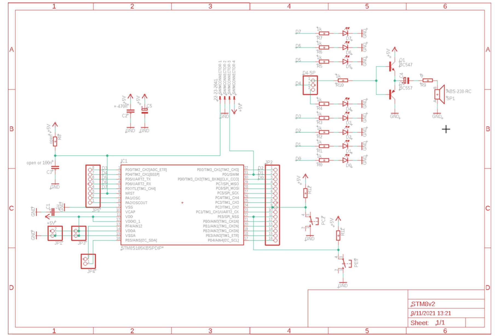

# ComputerArchitecture  

## 概述 | Overview  
本仓库包含基于 STM8S 系列微控制器的纯汇编裸机编程实践，用于深入理解计算机体系结构底层原理。代码直接操作硬件寄存器，无任何库依赖。  
This repository demonstrates bare-metal assembly programming for STM8S microcontrollers, focusing on low-level computer architecture concepts.

---

## 开发环境 | Development Environment  
- **IDE**: ST Visual Develop (STVD)  
- **工具链**: ST Assembler-Linker (ST Toolset)  
- **编程器**: ST-Link

---

## Features  
- Digital I/O Control
- Interrupt
- Timer
- Addressing
- Word instruction
- Parameter passing
- UART
- Pipelining Optimization
  
  **. . . . . .**

## Hardware

---